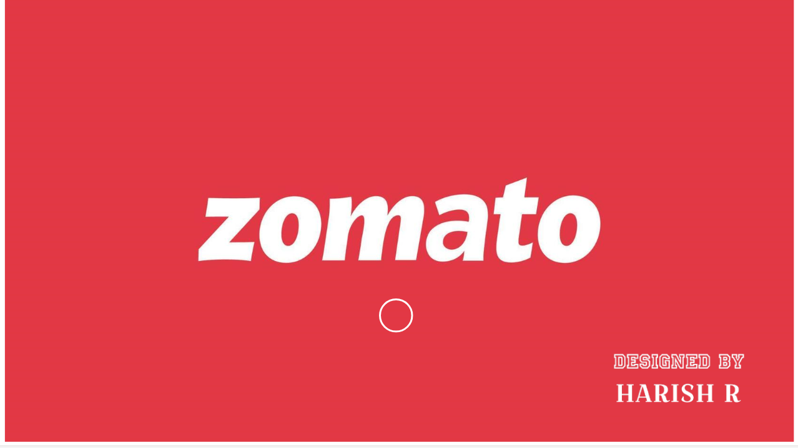
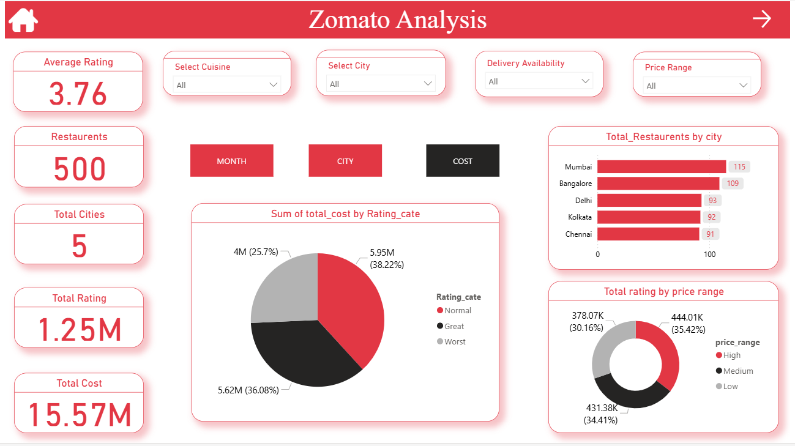
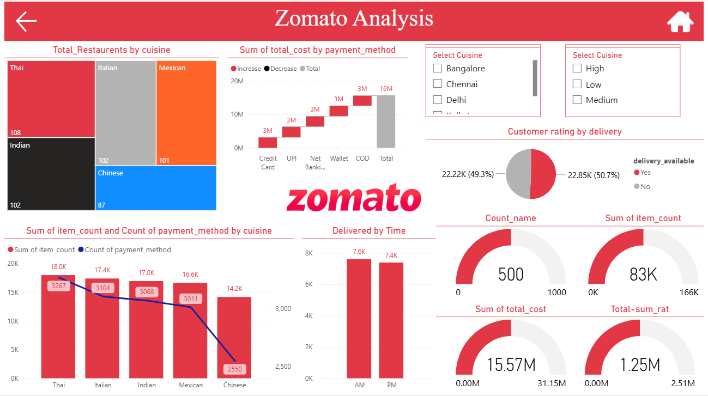

# 🍽️ Zomato Data Analysis Dashboard

## 📌 Overview
This project analyzes restaurant data from Zomato to understand customer preferences, ratings, and ordering behavior.

## 🛠️ Tools Used
- Power BI  
- Excel / CSV  

## 📊 Key Insights
- Analyzed restaurant ratings and trends  
- Identified popular cuisines  
- Studied customer ordering patterns  
- Used KPIs and visuals for business insights  

## 📸 Dashboard Preview

### 🔹 Overview Dashboard

### 🔹 Analysis Dashboard 1

### 🔹 Analysis Dashboard 2

## 🚀 Conclusion
This dashboard helps businesses understand customer behavior and improve service quality and growth strategies.
